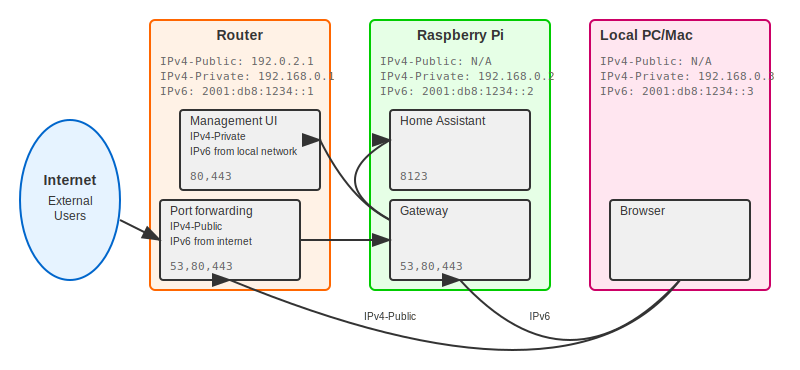

# Home Assistant Gateway Architecture

The Home Assistant Gateway acts as an DNS server and reverse proxy for your
Home Assistant instance and other services running in your home network.
It is designed to be deployed as a Home Assistant add-on,
leveraging the capabilities of the Home Assistant ecosystem.

It puts an additional layer of security between the internet and your home
network, by only exposing a single service (the Gateway) to the internet.
The Gateway then routes incoming requests to the appropriate service based on
the requested hostname.

This means that you need multiple DNS entries (subdomains) pointing to your home
network, one for each service you want to expose. But the available (free)
dynamic DNS services usually give you a single DNS entry only.

To work around this limitation, you need your domain where you can create
an `NS` record pointing to your home network.

As your home network usually has a dynamic IP address, you also need a dynamic DNS
service to keep the `NS` record up to date. This can be a free service like
`myfritz.net` or a paid service like `duckdns.org`.

The home assistant gateway contains a tiny DNS server which answers
all queries for your domain, with the IP address of your home network.
This allows you to expose multiple services on your home network using
subdomains.

This DNS server makes it possible to retrieve wildcard certificates from
`letsencrypt`!

## Prerequisites

- A domain name where you can create an `NS` record pointing to your home network.
- A dynamic DNS service to keep the `NS` record up to date.
- An internet router which is able to forward TCP ports 80 and 443 to the
  Home Assistant Gateway. And also UDP+TCP port 53 for the DNS server.
- A Home Assistant instance with the ability to install add-ons.

Assuming you own the domain `example.com` and you want to expose the
following services:

- Home Assistant: `ha.home.example.com`
- Your routers configuration UI: `router.home.example.com`

Your router supports dynamic DNS updates for the domain `myfritz.net`
and you have created the dynamic DNS entry `example.myfritz.net`.

You need to create the following DNS record:

- `NS` record for `home.example.com` pointing to `example.myfritz.net`

> HINT: you may create `NS` records for multiple subdomains of `example.com` like `dev.example.com`

## IP-V6 Support

If your home network has an external IP-V6 address, you would run into
trouble, if the integrated DNS server would answer with the external IP-V6 address.

If your browser would use the external IP-V6 address from your home-network, you would see the configuration-UI of your router, instead of the Home Assistant Gateway.

To get rid of this problem, the integrated DNS server will use its own IP-V6 address. If you now access `ha.home.example.com` from you local network, there will be no hop in between, but from the internet, it will
be routed by your internet-router. From the internet only the ports
forwarded by the router are allowed. From the local network, every port
is accessible.

## Letsencrypt

The Home Assistant Gateway can automatically retrieve and renew
`letsencrypt` certificates for your services. It uses the DNS-01 challenge
to prove the ownership of your domain. The DNS-01 challenge requires
that you create a specific DNS record for your domain, which is not
supported by all DNS providers. But as the Home Assistant Gateway
contains a DNS server, it can answer the DNS-01 challenge itself.

## Security

There are constantly running port scans on the internet, trying to find
vulnerable services. By using the Home Assistant Gateway, you only expose
a single service to the internet, which is the Home Assistant Gateway itself.

All `HTTP` requests are automatically redirected to `HTTPS`.

For all `HTTPS` requests which are not using `SNI` to specify the hostname
wil be closed without an answer. The same happens with unknown hostnames.

This alone will make most port scans useless.

But even if the attacker knows which hostname to use, there will be a
second authentication layer. The attacker needs to know a user + password,
before he can try to login to home-assistant, the router, ...
